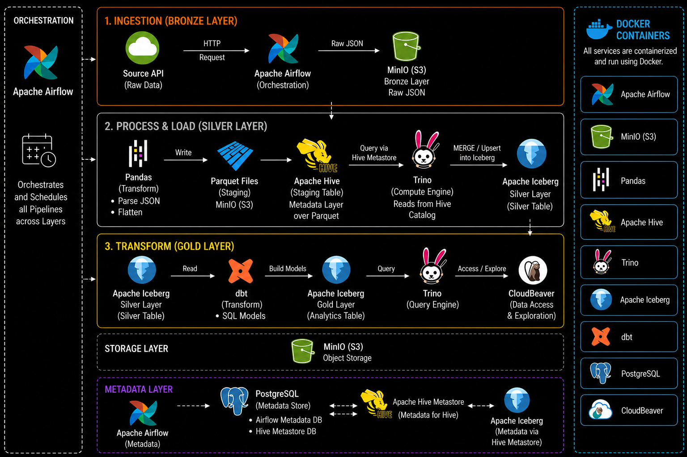

# 🚀 Modern Data Lakehouse with Medallion Architecture
### *Project Goal*

The goal of this project is to demonstrate how to build a modern data lakehouse using open source tools while implementing the Medallion Architecture.

### *Summary*
The Medallion Architecture is implemented as follows:


* **Bronze:** raw data is extracted from an API and ingested in the bronze bucket as JSON string.
* **Silver:** using Pandas, the bronze raw JSON gets cleaned, transformed and dumped to a staging hive table then inserted into the silver iceberg table to create a new snapshot.
* **Gold:** the silver iceberg table is used as the source to create gold tables/views ready for analytics using dbt.


---

## 🏗️ Architecture Diagram



---

## 🏗️ Architecture Overview

### 🔹 The Stack
* **PostgreSQL:** Physical metadata store for Airflow and Hive.
* **MinIO:** Storage layer for staging and clean data.
* **Hive Metastore:** Metadata catalogue for Hive and Iceberg tables.
* **Trino:** Computing Engine that reads from Hive and read/writes from/to Iceberg.
* **Apache Iceberg:** Table Format on top of Hive Metastore.
* **dbt:** Transformation from the silver to the golden layer.
* **Apache Airflow:** Orchestration for all three layers.
* **CloudBeaver:** Trino interface.

---

## 📊 Data Flow Summary

### 🥉 Bronze Layer (Raw Data)
* **Source:** CoinGecko API.
* **Storage:** Data stored as raw JSON (string) in MinIO to avoid schema breakage when API structure changes.

### 🥈 Silver Layer (Cleaned & Structured)
* Flattened API response into tabular format.
* Enforced schema and data types.
* Stored as Parquet in a STG Hive table.
* Loaded into Iceberg table using `MERGE` from the STG Hive table because Iceberg requires a commit (insert statement in this case) to manage the metadata and create a new table snapshot.
* The target silver iceberg table supports Idempotent loads using `coin_id` + `ingestion_ts` as the composite PK.

### 🥇 Gold Layer (Analytics)
* Built using **dbt models**.
* Transforms Silver data into analytics-ready datasets.
* Business-level aggregations and clean schemas.

---

## 🔄 The Stack Execution Flow
*(How the docker containers interact with each other)*

1.  **The Trigger (Airflow):** The Airflow scheduler determines it is time to run a job. It triggers a task that executes a dbt command (`dbt run`).
2.  Airflow executes the command `dbt run` inside its own container.
3.  The **dbt CLI** looks at `profiles.yml` (connects dbt with Trino).
4.  **dbt-trino** (the airflow dbt adapter) opens an HTTP connection from the Airflow container to the Trino container.
5.  **The Logic (dbt):** dbt compiles your SQL models. It connects to Trino and sends the SQL command.
6.  **The Command Center (Trino):** Trino receives the SQL. It checks its `iceberg.properties` and sees `catalog.type=hive_metastore`.
7.  **Trino calls the Hive Metastore:** "I need to execute the query. Where is the metadata?"
8.  The **Hive Metastore** looks into the Postgres database (its brain) to find the table's schema, partition info, and the location of the latest Iceberg metadata file.
9.  **The Response:** The Metastore returns a path to Trino, for example: `s3a://warehouse/orders/metadata/v12.metadata.json`.
10. **Direct Access (MinIO):** Trino bypasses the Metastore and goes directly to MinIO (Storage). It reads the JSON metadata, finds the list of required Parquet files, and pulls them into its RAM to do the math.
11. Trino does the work, and sends a "Success" message back to dbt (in the Airflow container).
12. **Visualization (CloudBeaver):** You, the user, open CloudBeaver in your browser. You connect to Trino and run the query. You see the data that dbt just finished processing.

---

## ⚙️ Lessons Learned

* ✅ **Docker:** .yml file structure and how lakehouse services interact.
* ✅ **Medallion Architecture:** The specific differences between Bronze, Silver, and Gold.
* ✅ **Python Libraries:** `requests` for API ingestion, `json` for object conversion, and `BytesIO` for memory buffering (working around Pandas/S3 limitations).
* ✅ **API Management:** The importance of handling error `429 - Too Many Requests`.
* ✅ **Bronze Strategy:** Storing raw JSON as string prevents pipeline breakage from API changes.
* ✅ **Data Integrity:** Enforcing data types after reading from bronze to prevent silver-loading errors.
* ✅ **Idempotency:** Implemented using `MERGE` in Iceberg to ensure safe re-runs.
* ✅ **Table Formats:** How Iceberg works in the backend (metadata.json structure) and the difference between Hive (file path) and Iceberg (commit) inserts.
* ✅ **Decoupling:** Understanding the split between storage (MinIO) and compute (Trino).
* ✅ **dbt Setup:** Configuring `dbt_project.yml`, `profiles.yml`, models, and tests.
* ✅ **Orchestration:** Using Airflow context and `xcom_pull` to share metadata between tasks.
* ✅ **Observability:** The importance of logging and error handling for debugging.
* ✅ **Timestamps:** Using `ingestion_ts` from the source instead of DAG context to maintain accurate lineage and prevent reprocessing issues across all layers.

---

## 📁 Project Structure

```text
.
├── containers_credentials.txt
├── dbt_setup_guide.pdf          # Guide to setup dbt for the project
├── docker-compose.yml
├── docker_setup.txt             # Guide to setup project docker image
├── README.md
├── stack_integration_explanation.txt # Detailed service interaction explanation
│
├── airflow/
│   ├── dags/
│   │   ├── coingecko_pipeline.py
│   │   ├── test.py
│   │   ├── testing_dbt.py
│   │   └── testing_lakehouse.py
│   ├── logs/
│   └── plugins/
│
├── dbt/
│   ├── dbt_project.yml
│   ├── profiles.yml
│   ├── logs/
│   │   └── dbt.log
│   └── models/
│       ├── sources.yml
│       ├── marts/
│       │   ├── coins_daily.sql
│       │   └── coins_latest.sql
│       └── staging/
│           └── stg_coins.sql
│
└── drivers/
    ├── hadoop-aws-3.3.4.jar
    ├── postgresql-42.7.4.jar
    └── aws-java-sdk-bundle-1.12.262.jar # file too large to upload
```

---

## 🐳 Running the Project

1.  Setup the containers and make sure they're integrated by following the steps in `docker_setup.txt`.
2.  Find service links and credentials in `containers_credentials.txt`.
3.  Open CloudBeaver and create the schemas `iceberg.silver` and `hive.silver`.
4.  Create the **Silver Iceberg Table**:
    ```sql
    CREATE TABLE iceberg.silver.coins_markets (
        coin_id VARCHAR,
        symbol VARCHAR,
        name VARCHAR,
        current_price DOUBLE,
        market_cap DOUBLE,
        total_volume DOUBLE,
        page_number INT,
        ingestion_ts TIMESTAMP,
        source VARCHAR
    )
    WITH (
        format = 'PARQUET',
        partitioning = ARRAY['day(ingestion_ts)']
    );
    ```
5.  Create the **Staging Hive Table**:
    ```sql
    CREATE TABLE hive.silver.stg_coins_markets (
        coin_id VARCHAR,
        symbol VARCHAR,
        name VARCHAR,
        current_price DOUBLE,
        market_cap DOUBLE,
        total_volume DOUBLE,
        page_number INTEGER,
        ingestion_ts TIMESTAMP,
        source VARCHAR
    )
    WITH (
        external_location = 's3a://warehouse/silver/coins_markets/stg_data/',
        format = 'PARQUET'
    );
    ```
6.  Ensure the `dbt` folder and its children exist in the project repo path.
7.  Ensure `coingecko_pipeline.py` exists in `airflow/dags`.
8.  Open Airflow web server and run the DAG. Upon success, fresh data will be available in `iceberg.silver.coins_markets`, `iceberg.dev_gold.coins_daily`, and `iceberg.dev_gold.coins_latest`.

---

## 🚀 Future Improvements
* Replace Pandas with Spark for scalability.
* Implement CDC ingestion.
* Add data quality checks (dbt tests / Great Expectations).
* Add dashboard layer (Superset / Power BI).
